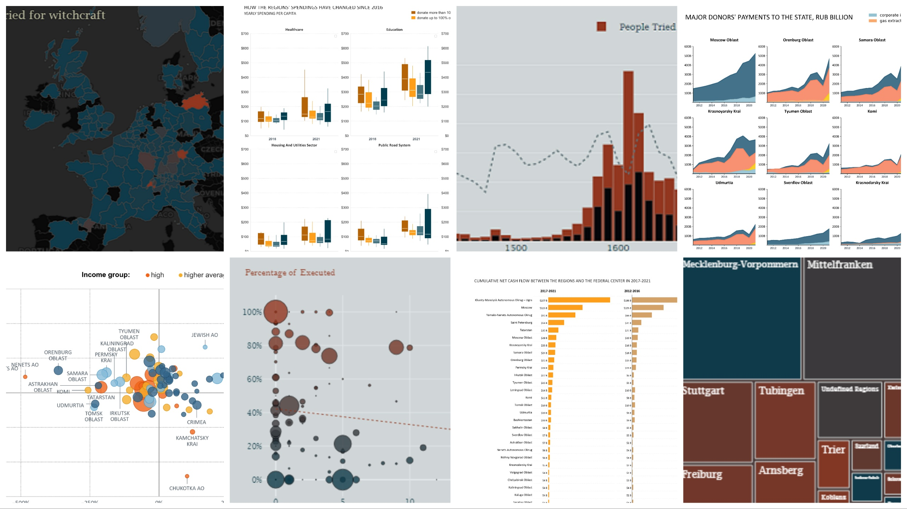

This repo contains my Python data analysis projects. I carry out the analysis in Jupiter notebook with <b>Pandas</b>, <b>NumPy</b>, and <b>GeoPandas</b>, and accompany it with visualizations made in <b>Matplotlib</b>, <b>Seaborn</b> and <b>Plotly</b>.
If I create a dataset for analysis myself, I describe all steps of its creation in an additional notebook.
Interactive vizzes make notebooks heavy, so they are best viewed through NBViewer. 

| Project | Description | Added | Techniques | Notebook (NBViewer) | 
| --- | --- | --- | --- | --- |
| <b>Russian Regional Money Flows Analysis</b> | Huge imbalances exist between the Russian regions in terms of how much money they give or take from the federal center (the so-called "snickering" Moscow), as well as in terms of the income and perspectives of their dwellers. I use my newly created regional budget dataset to explore these imbalances. | 19-11-2023 | EDA, Time series, Geospatial, Visualization | [Link](https://nbviewer.org/github/lomska/Data-Analysis-Python/blob/main/Russian-Regional-Money-Analysis/Russian_Regional_Money_Analysis.ipynb) |
| <b>Witch Trials in Europe 1300-1850 Data Analysis</b> | I explore and visualize the data on witch trials and executions in Europe between 1300 and 1850 which was collected by T. Leeson and Jacob W. Russ for their [economic research](https://www.peterleeson.com/Witch_Trials.pdf). | 19-11-2023 | EDA, Time series, Geospatial, Visualization | [Link](https://nbviewer.org/github/lomska/Data-Analysis-Python/blob/main/Witch_Trials_In_Europe_Data_Analysis/Witchy-Years-Notebook.ipynb) |
